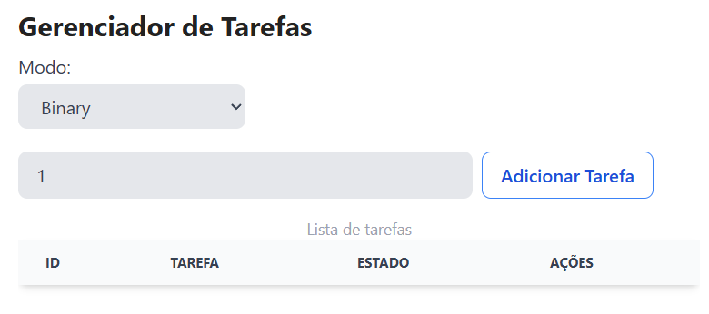
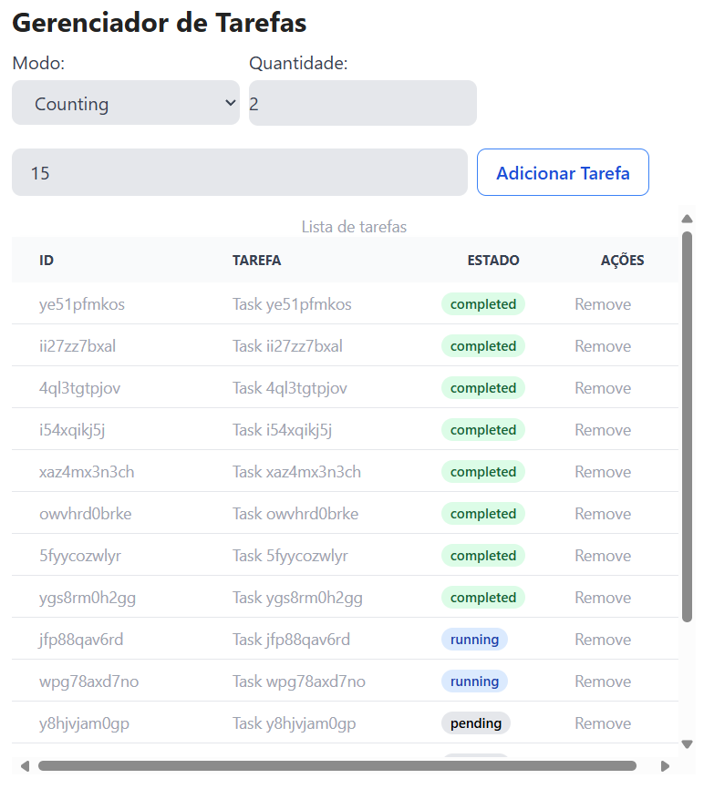

# Synchronization simulator

This is a simple synchronization simulator that simulates the behavior of a set of threads that are trying to access a
shared resource. The simulator uses the following synchronization primitives:

- **Mutex**: A mutex is a lock that allows only one thread to access a shared resource at a time. If a thread tries to
  access the resource while another thread is using it, the thread will block until the resource is available.
- **Semaphore**: A semaphore is a counter that allows a certain number of threads to access a shared resource at a time.
  If the counter reaches zero, the threads will block until the counter is incremented.

The simulator uses a task queue to simulate the behavior of the threads. Each thread is represented by a task that
executes a set of instructions (e.g., acquire a lock, release a lock, etc.). The tasks are added to the task queue, and
the simulator executes them in order, based on parallelism constraints.

## Usage

The main screen of the simulator displays the following information:

- **Task Queue**: A list of tasks that are waiting, in progress, or completed.
- **Mode**: The current mode of the simulator is running. This represents if the simulator is actually with Binary
  Semaphore (Mutex) or Counting Semaphore, and the number of threads that can access the shared resource at a time.
- **Add Task**: A button that allows you to add a quantity of tasks in the input field to the task queue.

The FIGURE 1 shows the main screen of the simulator.



FIGURE 1: Main screen of the simulator.

## Task

A task is a set of instructions that a thread executes that can assume the following states:

- **Waiting**: The task is waiting to be executed.
- **Running**: The task is currently being executed.
- **Completed**: The task has been executed successfully.

The following code snippet shows an example of a task that acquires a lock, waits for a random amount of time, and then
releases the lock:

```js

class Task {
  // ...
  async run() {
    await this.semaphore.acquire();

    this.status = 'running';
    // notify the task taskManager that the state has changed
    this.onStateChange && this.onStateChange(this);

    setTimeout(() => {
        this.status = 'completed';
        this.onStateChange && this.onStateChange(this);
        this.semaphore.release();
      },
      // interval between 1 and 5 seconds
      Math.floor(Math.random() * 5) * 1000
    );
  }

  // ...
}
```

The task class has a `run` method that acquires a semaphore, changes the status to running, waits for a random amount of
time, changes the status to completed, and releases the semaphore.

## Task Queue

The example of the task queue is shown in the FIGURE 2.



FIGURE 2: Task queue.

The task queue is a list of tasks that are waiting, in progress, or completed. The task queue has the following
features:

- **Add Task**: A button that allows you to add a quantity of tasks in the input field to the task queue.
- **Task**: A task that is waiting, in progress, or completed.
- **Status**: The status of the task (waiting, running, or completed).
- **Actions**: A set of actions that you can perform on the task (e.g., remove the task from the queue).
